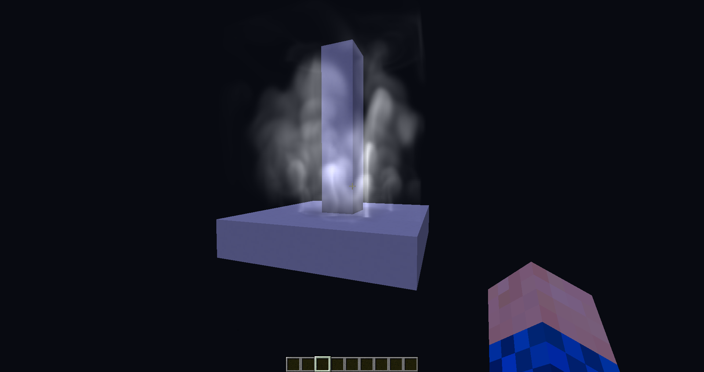
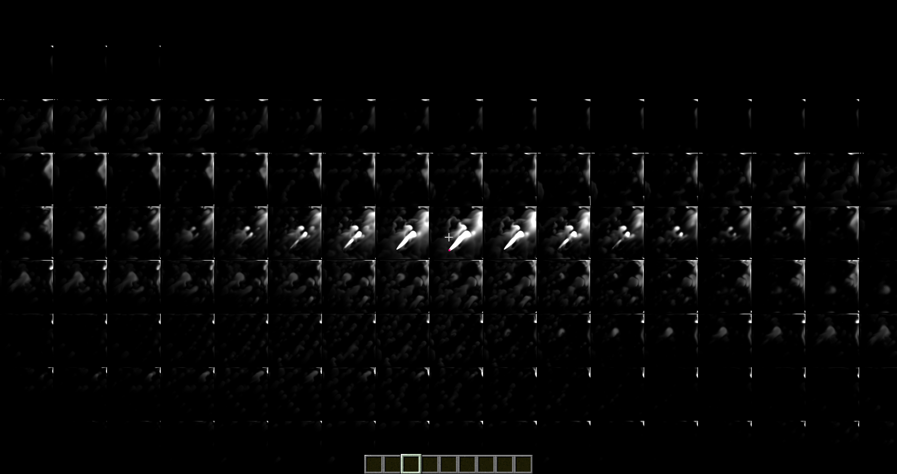

# MCShaderCFD
A very crude GPU accelerated grid based fluid simulation in Minecraft written in GLSL using the Optifine Mod.
MCShaderCFD is a shaderpack that can be simply installed by cloning this repository in the shaderpacks minecraft folder.

# Visualisation
The simulation is integrated in the Minecraft world with a ray marched approach.

In-game demonstration (115³ voxels):

# Data representation
The simulation state is stored by layer in a 2D buffer and updated each frame with its previous state.

